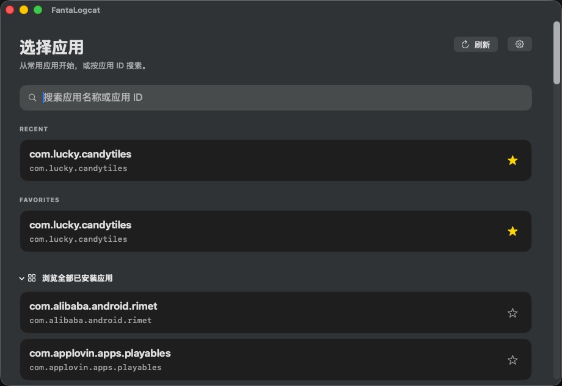
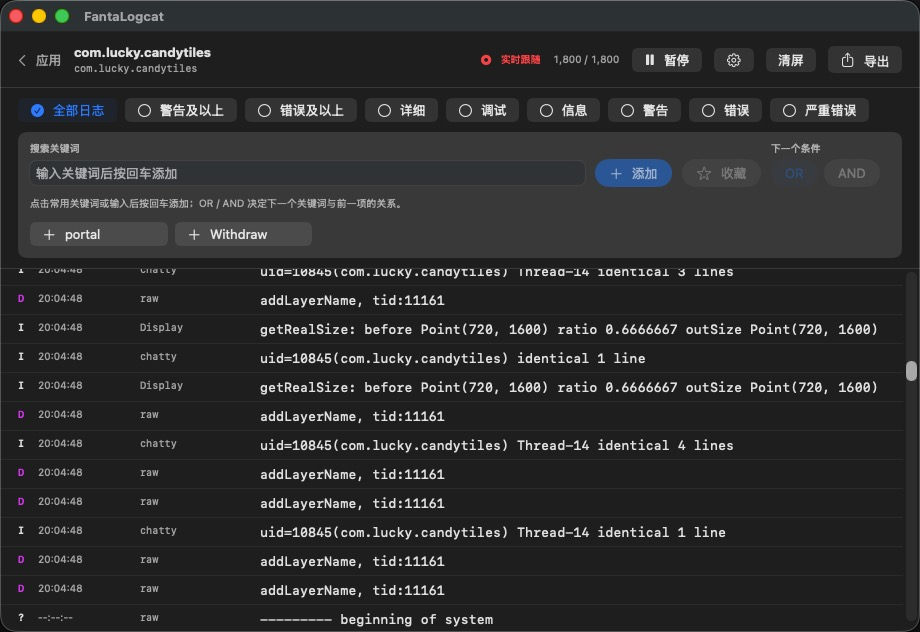

<p align="center">
  
</p>

<h1 align="center">FantaLogcat</h1>

<p align="center">
  原生 macOS Android 调试工作台：把实时 Logcat 和常用 ADB 操作留在一个窗口里。
</p>

<p align="center">
  <a href="https://lijing233.github.io/FantaLogcat/">应用主页</a> ·
  <a href="https://github.com/lijing233/FantaLogcat/releases/latest">下载最新版</a> ·
  <a href="https://github.com/lijing233/FantaLogcat/issues">问题反馈</a>
</p>

## 功能概览

### 可靠的实时 Logcat

- 选择设备与应用后，自动跟踪主进程和子进程，主机端按 PID 过滤并保留完整堆栈续行。
- 应用停止、崩溃或重启后自动刷新 PID；ADB 瞬时退出时按退避策略恢复采集。
- 按日志等级筛选，并使用关键词卡片与 `OR` / `AND` 关系构建组合查询。
- 有界环形缓存控制长时间会话的内存占用，支持暂停、清屏、自动跟随与导出。
- 导出前可对常见 token、密码和密钥模式脱敏，默认启用脱敏。

### 可视化 ADB 工具箱

- 拖入 APK 即可安装，安装后展示应用信息并支持直接打开。
- 按需下载并管理 `scrcpy`，启动屏幕镜像后可从应用内关闭。
- 发送 Deeplink；可保存、命名和复用常用链接，并可在高级选项中指定处理应用。
- 读取当前 Activity，复制组件名，保存常用 Activity，并直接执行 `am start -n`。
- 向设备发送普通文本或 JSON；支持清空、复制与 JSON 格式校验。
- 打开、关闭、重启应用，或在二次确认后清除应用数据。
- 一键截图并快速打开保存位置；读取屏幕、设备标识与 GAID 等设备信息。
- 最近使用应用、搜索选择、键盘导航，让重复操作更快完成。

### 原生 macOS 体验

- 深色、浅色或跟随系统主题，切换后立即生效。
- 可设置启动时默认进入 Logcat 应用选择页或工具箱。
- 内置 Sparkle 自动更新：可自动检查、选择自动下载，或随时手动检查 GitHub 发布的新版本。
- 无需预装 `adb`：首次使用时按需下载 Google 官方 Platform-Tools，并在安装前校验 SHA-256。

## 界面预览

### 应用选择

从最近使用、收藏或设备上的全部已安装应用中定位目标，也可以按应用名称和包名搜索。



### 实时日志与组合搜索

在同一个窗口中查看实时日志、切换等级、暂停或清屏，并通过关键词卡片组合查询。



## 下载与安装

推荐从 GitHub Releases 下载 `FantaLogcat-macos-arm64.dmg`：

1. 双击打开 DMG。
2. 将 `FantaLogcat.app` 拖到窗口中的 `Applications` 快捷方式。
3. 从“应用程序”、Launchpad 或 Spotlight 启动 FantaLogcat。

也可以下载 ZIP，解压后手动将应用移入“应用程序”目录。DMG 和 ZIP 均提供同名 `.sha256` 文件，可在下载目录中校验：

```sh
shasum -a 256 -c FantaLogcat-macos-arm64.dmg.sha256
```

公开发布版本仍需由维护者使用 Apple Developer ID 签名并完成公证。未公证的本地构建可能被 Gatekeeper 拦截；请右键应用选择“打开”，或仅在“系统设置 → 隐私与安全性”中为该应用选择“仍要打开”，不要全局关闭 Gatekeeper。

## 系统要求

- Apple 芯片 Mac（`arm64`），macOS 13 或更高版本。
- 已启用“开发者选项”和“USB 调试”或“无线调试”的 Android 设备。
- USB 调试需要可传输数据的线缆，并在设备上确认调试授权。

## 快速开始

1. 通过 USB 连接设备，或完成无线调试配对。
2. 如设备弹出授权提示，请允许这台 Mac 进行调试。
3. 选择首页入口：进入 Logcat 后选择目标应用，或直接进入工具箱。
4. 首次使用 Android 工具时，阅读许可条款并安装 Platform-Tools。

Activity 能否由 ADB 打开取决于目标应用：已导出的 Activity 通常可直接打开；未导出的 Activity 仅在应用可调试并允许 `run-as`，或设备具备相应权限时可打开。FantaLogcat 会在失败位置显示设备返回的具体原因。

## 隐私与本地数据

日志只保存在当前内存缓存中，不会自动写入持久化日志档案。设置、最近使用记录、关键词收藏、Deeplink 收藏和 Activity 收藏保存在本机。所有导出、截图、安装与设备操作都需要用户主动触发。

自动脱敏无法保证覆盖所有秘密信息、个人数据或专有内容，分享导出文件前请人工复核。

## 本地开发

项目使用 Swift 6、SwiftUI + AppKit 与 XcodeGen。常用命令：

```sh
make generate   # 生成 Xcode 工程
make test       # 运行测试
make build      # 构建 Release 应用
make release    # 生成 DMG、ZIP 及 SHA-256 校验文件
make appcast    # 使用钥匙串中的 EdDSA 私钥生成 Sparkle 更新 Feed
```

`make release` 会在 `.build/releases` 生成：

- `FantaLogcat-macos-arm64.dmg` 与对应 `.sha256`
- `FantaLogcat-macos-arm64.zip` 与对应 `.sha256`

Sparkle 更新 Feed 位于 `docs/appcast.xml`。EdDSA 私钥只保存在发布者的 macOS Keychain 中，不得提交到仓库；发布前应离线备份该密钥。

## 当前限制

- 当前版本一次选择一个应用进行 Logcat 采集，不用于完全替代 Android Studio 或所有 Android 调试工具。
- 工具箱操作是否成功取决于设备状态、调试授权、Android 权限和目标应用的 Manifest 配置。
- 无线调试必须在设备上保持开启，并与 Mac 网络互通。
- `scrcpy` 需要首次下载外部组件；后续由 FantaLogcat 管理启动状态。

## 参与项目

- [贡献指南](CONTRIBUTING.md)
- [安全策略](SECURITY.md)
- [行为准则](CODE_OF_CONDUCT.md)
- [Apache License 2.0](LICENSE)
- [第三方声明](NOTICE)
- [发布检查清单](docs/RELEASE_CHECKLIST.md)
